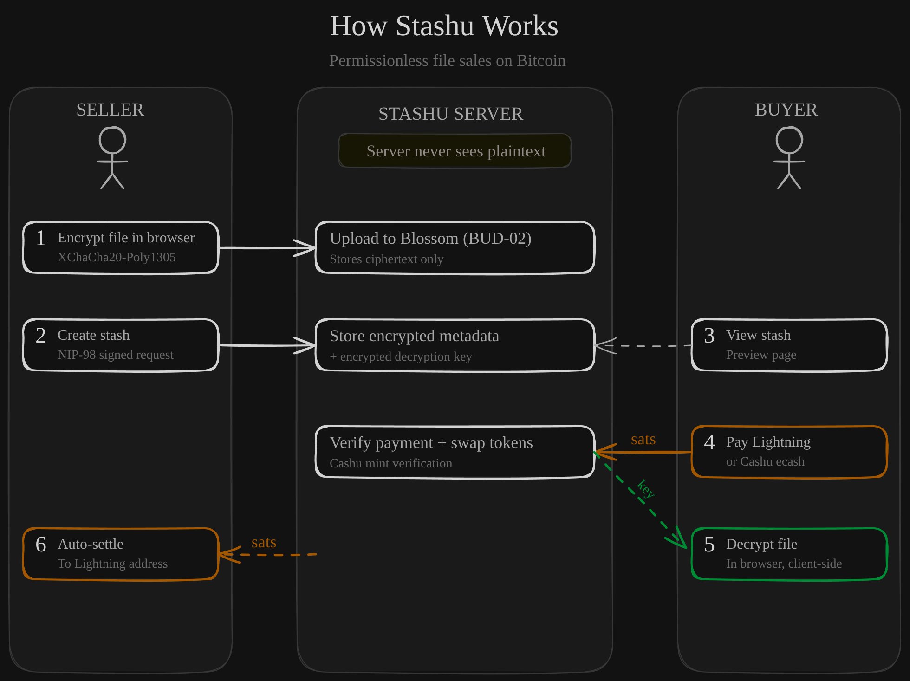

<div align="center">
  
  <h1>Stashu</h1>
  <p>
    <strong>Sell any file for sats. No accounts. No KYC. No middlemen.</strong>
  </p>
</div>

---

## Why Stashu?

Stashu is a pay-to-unlock file marketplace built on Bitcoin. Buyers pay with Lightning or Cashu ecash. No accounts on either side.

- **Near-zero fees** - Lightning routing costs only
- **Instant settlement** - sellers get paid in seconds
- **Permissionless** - buyers need nothing, sellers need a Nostr keypair
- **Microtransactions** - sell a 100-sat preset or a 50,000-sat course
- **Client-side encryption** - the server never sees your files
- **Self-hostable** - run your own instance
- **Open source** - MIT license

## How It Works

<!-- Excalidraw source: https://excalidraw.com/#json=2ca7AoYvnBQkfSxFIuWww,hmzinQn2W01SGoQqXrCWUg -->
<div align="center">
  
</div>

1. **Seller encrypts** - file is encrypted client-side before leaving the browser. Encrypted blob goes to a Blossom server.
2. **Seller creates stash** - title, description, price in sats. Gets a shareable link.
3. **Buyer pays** - scans a Lightning QR code or pastes a Cashu ecash token.
4. **Buyer receives key** - server verifies payment, returns the decryption key. File downloads and decrypts in-browser.
5. **Seller gets paid** - earnings settle to seller's Lightning address.

## Quick Start

```bash
git clone https://github.com/keshav0479/Stashu.git
cd Stashu
npm install

# Configure environment
cp server/.env.example server/.env
# server/.env requires TOKEN_ENCRYPTION_KEY, generate one:
# node -e "console.log(require('crypto').randomBytes(32).toString('hex'))"

cp client/.env.example client/.env  # Optional, defaults work for local dev

npm run dev
```

- **Client:** http://localhost:5173
- **Server:** http://localhost:3000

## Tech Stack

| Layer      | Technology                                |
| ---------- | ----------------------------------------- |
| Frontend   | React 19, Vite, TypeScript, TailwindCSS 4 |
| Backend    | Hono, TypeScript, better-sqlite3          |
| Database   | SQLite (WAL mode, foreign keys)           |
| Storage    | Blossom (BUD-02 protocol)                 |
| Encryption | XChaCha20-Poly1305 (`@noble/ciphers`)     |
| Payment    | Cashu ecash + Lightning (LUD-16)          |
| Identity   | Local Nostr keypair with nsec recovery    |
| Auth       | NIP-98 HTTP Auth (Nostr event signatures) |

## Security Model

> Stashu V1 is a trusted escrow. The server facilitates payments and holds encrypted data. Here's what's protected, what isn't, and the plan for removing trust in V2.

### What's protected

- **Files in transit and at rest** - XChaCha20-Poly1305 encryption happens entirely in the browser before upload. Blossom servers and anyone intercepting traffic see only ciphertext.
- **All sensitive DB columns** - `secret_key`, `title`, `description`, `file_name`, `seller_token`, `ln_address`, and change proof tokens are encrypted at rest with XChaCha20-Poly1305. A raw DB dump reveals no plaintext.
- **Seller identity** - NIP-98 Schnorr signatures on all seller endpoints. No passwords, no sessions, cryptographic auth only.
- **Payment integrity** - quote-to-stash binding prevents cross-stash replay. Atomic processing lock prevents concurrent mint races. Idempotent unlock prevents double-spending.
- **Rate limiting** - public endpoints rate-limited (~10-60 req/min). With `TRUSTED_PROXY=1`, limits apply per client IP.

### Known limitations

| Threat                 | Details                                                                                                  |
| ---------------------- | -------------------------------------------------------------------------------------------------------- |
| XSS key theft          | Nostr private key lives in browser localStorage. Same trade-off as every Nostr web client.               |
| Full server compromise | `TOKEN_ENCRYPTION_KEY` is co-located with the DB. A root-level compromise exposes all encrypted columns. |
| Operator fund theft    | Server custodies Cashu tokens between payment and withdrawal. A malicious operator could drain funds.    |

V2 addresses these - see [Roadmap](#roadmap) below.

## Roadmap

### V1: Trusted Escrow (current)

Working pay-to-unlock marketplace. Server holds encrypted keys and custodies payment tokens. Trust-minimized but not trustless.

**Next:**

- [x] Server route + client test suites
- [ ] Stash lifecycle (edit price/description, unpublish/delete)
- [ ] Fee transparency (warn when withdrawal fee > 10%)
- [ ] Deployment guide + HTTPS/Tor setup

### V2: Trust-Minimized

Remove the server's ability to access file contents or spend seller funds.

- [ ] **NIP-44 key exchange** - seller encrypts the file key to a per-stash ephemeral key. Buyer receives the decryption key via NIP-44 encrypted Nostr DM after payment. The server never sees the plaintext key.
- [ ] **NUT-11 P2PK tokens** - Pay-to-Public-Key Cashu tokens lock funds to the seller's Nostr pubkey. The server facilitates the swap but cryptographically cannot spend the tokens.
- [ ] **Multi-mint support** - remove single `MINT_URL` dependency. Buyers and sellers choose their own mints.

## Development & Testing

```bash
# Run everything
npm run dev

# Run only client or server
npm run dev:client
npm run dev:server

# Build
npm run build

# Test (server)
npm run test --workspace=server

# Lint (client)
npm run lint --workspace=client

# Format check
npx prettier --check .

# Docker
docker compose up --build
```

### Environment Variables

**Server** (required):

- `TOKEN_ENCRYPTION_KEY` - 64 hex chars. Server refuses to start without it.
- `MINT_URL` - Cashu mint URL
- `CORS_ORIGINS` - Allowed origins
- `DB_PATH` - SQLite database path

**Client** (optional, defaults work for dev):

- `VITE_API_URL` - Server API URL
- `VITE_BLOSSOM_URL` - Blossom server URL

## Contributing

See [CONTRIBUTING.md](CONTRIBUTING.md) for setup instructions, testing, and PR guidelines.

## License

MIT
